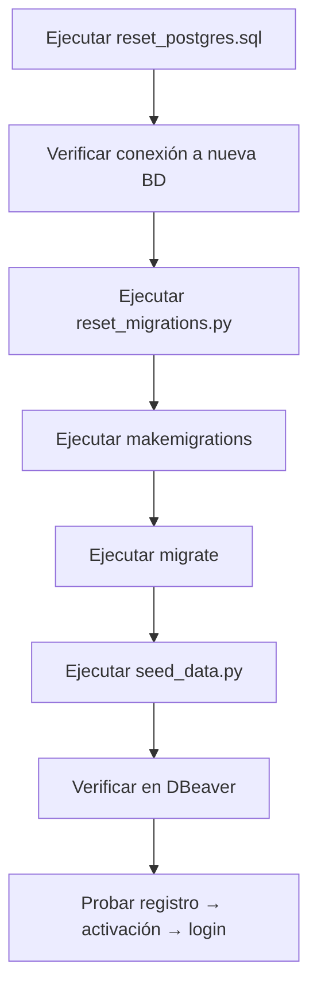

# Changelog - Reset Completo del Sistema

## Resumen de Cambios

Este documento detalla todos los cambios realizados para resolver los problemas de inconsistencia de base de datos y preparar el sistema para un reset completo.

---

## 🗄️ Base de Datos PostgreSQL

### Cambios en Credenciales

| Antes | Después |
|-------|---------|
| `DATABASE_NAME=clinic_record_db` | `DATABASE_NAME=clinic_records_db` |
| `DATABASE_USER=cr_admin` | `DATABASE_USER=clinic_admin` |
| `DATABASE_PASSWORD=cr_admin123` | `DATABASE_PASSWORD=clinic2024!` |

**Razón**: Nombres más descriptivos y consistentes. El nuevo nombre usa plural "records" que es más correcto.

---

## 📄 Archivos Modificados

### 1. `.env`
**Líneas modificadas**: 6-12

**Cambios**:
```diff
- DATABASE_NAME=clinic_record_db
- DATABASE_USER=cr_admin
- DATABASE_PASSWORD=cr_admin123
+ DATABASE_NAME=clinic_records_db
+ DATABASE_USER=clinic_admin
+ DATABASE_PASSWORD=clinic2024!
```

---

### 2. `config/settings/base.py`
**Líneas modificadas**: 98-109

**Cambios**:
- ❌ **Eliminado**: Soporte para SQLite
- ❌ **Eliminado**: Condicional `if DATABASE_ENGINE == 'postgresql'`
- ✅ **Agregado**: Configuración exclusiva de PostgreSQL
- ✅ **Agregado**: `'ATOMIC_REQUESTS': True` para transacciones seguras

**Antes**:
```python
DATABASE_ENGINE = config('DATABASE_ENGINE', default='sqlite')

if DATABASE_ENGINE == 'postgresql':
    DATABASES = {
        'default': {
            'ENGINE': 'django.db.backends.postgresql',
            # ...
        }
    }
else:
    DATABASES = {
        'default': {
            'ENGINE': 'django.db.backends.sqlite3',
            'NAME': BASE_DIR / 'db.sqlite3',
        }
    }
```

**Después**:
```python
# Database - PostgreSQL ONLY (no SQLite)
DATABASES = {
    'default': {
        'ENGINE': 'django.db.backends.postgresql',
        'NAME': config('DATABASE_NAME', default='clinic_records_db'),
        'USER': config('DATABASE_USER', default='clinic_admin'),
        'PASSWORD': config('DATABASE_PASSWORD'),
        'HOST': config('DATABASE_HOST', default='localhost'),
        'PORT': config('DATABASE_PORT', default='5432'),
        'ATOMIC_REQUESTS': True,  # Transacciones automáticas
    }
}
```

---

### 3. `scripts/reset_migrations.py`
**Estado**: ✅ **NUEVO ARCHIVO** (144 líneas)

**Propósito**: Automatizar la eliminación de todos los archivos de migración.

**Funcionalidad**:
- Elimina todos los archivos `.py` en carpetas `migrations/` de todas las apps
- Mantiene los archivos `__init__.py`
- Elimina carpetas `__pycache__/`
- Muestra estadísticas de archivos eliminados
- Requiere confirmación explícita ("SI")

**Apps incluidas**:
- `apps.core`
- `apps.accounts`
- `apps.tenants`
- `apps.patients`
- `apps.clinical_records`
- `apps.documents`
- `apps.audit`
- `apps.reports`
- `apps.backup`
- `apps.notifications`

---

### 4. `scripts/seed_data.py`
**Estado**: ✅ **COMPLETAMENTE REESCRITO** (756 líneas)

**Cambios**: Consolidación de TODOS los seeders en un solo archivo mega-seeder.

**Anteriormente había seeders separados**:
- `seed_subscription_plans.py`
- `seed_clinical_records.py`
- `seed_reports.py`
- `seed_clinical_forms.py`

**Ahora TODO está en `seed_data.py`**, que crea:

1. **Superusuario ASU**
   - Email: `asu@system.com`
   - Password: `ASU@2024!`
   - Role: ASU (sin tenant)

2. **3 Planes de Suscripción**
   - Básico: $1/mes
   - Profesional: $19/mes
   - Empresarial: $49/mes

3. **2 Tenants de Prueba**
   - Hospital Santa Cruz (`hospital-santacruz`)
   - Clínica La Paz (`clinica-lapaz`)

4. **Roles y Permisos** (por tenant)
   - Administrador TI
   - Doctor
   - Paciente

5. **5 Usuarios por Tenant**
   - 1 Admin TI
   - 2 Doctores
   - 2 Usuarios tipo Paciente

6. **50 Pacientes con Datos Realistas**
   - Usa Pandas + Faker
   - Nombres, emails, teléfonos, direcciones
   - Tipos de sangre, género, fecha de nacimiento

7. **100+ Historias Clínicas**
   - Motivo de consulta
   - Diagnóstico
   - Tratamiento
   - Relaciones con doctores y pacientes

8. **50+ Documentos Clínicos**
   - PDFs simulados
   - Asociados a historias clínicas

9. **Templates de Reportes**
   - Reporte de Consulta Médica
   - Historia Clínica Completa
   - Resumen de Tratamiento

**Características Clave**:
- Usa `get_or_create` para evitar duplicados
- Transacciones atómicas
- Logging detallado con estadísticas
- Muestra todas las credenciales al final
- Manejo de errores robusto

---

### 5. `scripts/seed_data_reset.py`
**Líneas modificadas**: Todo el archivo (230 líneas)

**Cambios**:
- ❌ **Eliminado**: Llamada a `seed_data.main()` al final
- ✅ **Agregado**: Solo BORRA datos, no los recrea
- ✅ **Mejorado**: Verificación de que la BD quedó vacía
- ✅ **Mejorado**: Orden correcto de eliminación respetando foreign keys

**Orden de Eliminación** (respeta foreign keys):
1. `AuditLog`
2. `Notification`
3. `UserPreferences`
4. `ClinicalDocument`
5. `ClinicalRecord`
6. `Patient`
7. `User`
8. `Role`
9. `Permission`
10. `TenantRegistration`
11. `Tenant`
12. `SubscriptionPlan`

---

### 6. `apps/tenants/services.py`
**Líneas modificadas**: 107-228

**Cambios**:
- ✅ **Agregado**: Logging exhaustivo en el método `activate_tenant()`
- ✅ **Agregado**: Logs con prefijo `[ACTIVATE]` para fácil búsqueda
- ✅ **Agregado**: Verificación explícita de que el usuario se creó en BD

**Nuevos logs**:
```python
logger.info(f"[ACTIVATE] Iniciando activación con token: {token[:20]}...")
logger.info(f"[ACTIVATE] ✅ Tenant CREADO: ID={tenant.id}, name={tenant.name}")
logger.info(f"[ACTIVATE] ✅ Rol CREADO: ID={role.id}, name={role.name}")
logger.info(f"[ACTIVATE] ✅ Usuario CREADO: ID={user.id}, email={user.email}")
logger.info(f"[ACTIVATE] ✅ VERIFICACIÓN: Usuario encontrado en BD")
```

**Propósito**: Diagnosticar el problema de "User not found" después de activación.

---

### 7. `apps/accounts/constants.py`
**Estado**: ✅ **NUEVO ARCHIVO** (180 líneas)

**Propósito**: Centralizar todas las constantes de roles y permisos.

**Clases principales**:

```python
class SystemRoles:
    """Nombres de los 2 únicos roles fijos del sistema"""
    ASU = "ASU"                    # Superusuario global
    ADMIN_TI = "Administrador TI"  # Admin por tenant

class PermissionCodes:
    """Códigos únicos de permisos"""
    VIEW_TENANT = "view_tenant"
    MANAGE_USERS = "manage_users"
    # ... 50+ permisos más
```

**Funciones auxiliares**:
```python
def get_admin_email(subdomain: str, base_domain: str) -> str:
    """Genera email: admin@{subdomain}.{base_domain}"""
    return f"admin@{subdomain}.{base_domain}"

def get_user_email(username: str, subdomain: str, base_domain: str) -> str:
    """Genera email: {username}@{subdomain}.{base_domain}"""
    return f"{username}@{subdomain}.{base_domain}"
```

**Razón**: Evitar inconsistencias de nombres de roles ("Administrador" vs "Administrador TI" vs "Administrativo").

---

### 8. `apps/accounts/views.py`
**Líneas modificadas**: 70-71, 148-149

**Cambios**:
```diff
- name='Administrador'
+ name=SystemRoles.ADMIN_TI

- role__name='Administrativo'
+ role__name=SystemRoles.ADMIN_TI
```

**Razón**: Usar constantes centralizadas en lugar de strings hardcodeados.

---

### 9. `apps/tenants/views.py`
**Línea modificada**: 40

**Cambios**:
```diff
- if self.request.user.role and self.request.user.role.name == 'ASU':
+ if self.request.user.is_superuser:
```

**Razón**: Usar el campo `is_superuser` es más robusto que verificar el nombre del rol.

---

### 10. `scripts/diagnose_activation.py`
**Estado**: ✅ **NUEVO ARCHIVO** (208 líneas)

**Propósito**: Herramienta de diagnóstico para verificar el estado de registros y activaciones.

**Uso**:
```bash
# Listar todos los tenants y registros
python scripts/diagnose_activation.py --list

# Diagnosticar un tenant específico
python scripts/diagnose_activation.py --subdomain clinica-test

# Diagnosticar un registro específico
python scripts/diagnose_activation.py --registration-id abc-123
```

**Qué verifica**:
1. Estado de `TenantRegistration` (activado/pendiente)
2. Existencia de `Tenant` correspondiente
3. Roles del tenant
4. Usuarios del tenant (especialmente el admin)
5. Búsqueda de usuarios similares si no encuentra el admin

---

### 11. `scripts/seed_clinical_forms.py`
**Línea modificada**: 253

**Cambios**:
```diff
- role__name__in=['Doctor', 'Administrador']
+ role__name__in=['Doctor', SystemRoles.ADMIN_TI]
```

**Razón**: Consistencia con el nombre estandarizado del rol de admin.

---

## 📦 Archivos Nuevos Creados

### Scripts de Reset

1. **`reset_postgres.sql`** (71 líneas)
   - Script SQL para resetear PostgreSQL completamente
   - Ejecutar con: `psql -U postgres -f reset_postgres.sql`

2. **`reset_django.bat`** (82 líneas)
   - Script batch de Windows para automatizar reset de Django
   - Ejecuta: reset_migrations → makemigrations → migrate → seed_data

### Documentación

3. **`RESET_DATABASE_GUIDE.md`** (483 líneas)
   - Guía exhaustiva paso a paso
   - Incluye comandos de PostgreSQL
   - Incluye solución de problemas
   - Incluye verificaciones en DBeaver

4. **`QUICK_START.md`** (223 líneas)
   - Guía rápida de 2 comandos
   - Ideal para ejecución rápida
   - Incluye pruebas del sistema

5. **`CHANGELOG_RESET.md`** (Este archivo)
   - Documentación de todos los cambios
   - Referencias a líneas modificadas
   - Explicación de razones

---

## 🐛 Problemas Resueltos

### 1. Inconsistencia de Nombres de Roles
**Problema**: Se usaban múltiples nombres para el mismo rol:
- "Administrador TI"
- "Administrador"
- "Administrativo"

**Solución**: Creación de `apps/accounts/constants.py` con `SystemRoles.ADMIN_TI`.

---

### 2. Seeders Dispersos
**Problema**: Múltiples archivos de seeder difíciles de mantener.

**Solución**: Consolidación en un solo `seed_data.py` de 756 líneas.

---

### 3. seed_data_reset.py Creaba Datos
**Problema**: El script de reset llamaba a `seed_data.main()` al final, confundiendo su propósito.

**Solución**: Eliminada la llamada. Ahora solo BORRA datos.

---

### 4. Configuración Mixta SQLite/PostgreSQL
**Problema**: `config/settings/base.py` tenía lógica condicional para ambos motores.

**Solución**: Eliminado todo lo relacionado con SQLite. Solo PostgreSQL.

---

### 5. Falta de Logging en Activación
**Problema**: No había forma de diagnosticar por qué la activación fallaba.

**Solución**: Agregado logging exhaustivo con prefijo `[ACTIVATE]` en `apps/tenants/services.py`.

---

### 6. No Había Herramienta de Diagnóstico
**Problema**: Difícil saber el estado real de registros y usuarios.

**Solución**: Creación de `scripts/diagnose_activation.py`.

---

### 7. Nombres de BD Inconsistentes
**Problema**: `clinic_record_db` (singular) no es descriptivo.

**Solución**: Cambio a `clinic_records_db` (plural).

---

## 🔄 Proceso de Reset Completo

### Resumen de Pasos



### Comandos Ejecutar

```bash
# 1. PostgreSQL
psql -U postgres -f reset_postgres.sql

# 2. Django (todo automatizado)
reset_django.bat

# 3. Verificar
python scripts/diagnose_activation.py --list

# 4. Iniciar servidor
python manage.py runserver
```

---

## 📊 Estadísticas

### Líneas de Código Modificadas/Creadas

| Archivo | Líneas | Estado |
|---------|--------|--------|
| `seed_data.py` | 756 | Reescrito |
| `RESET_DATABASE_GUIDE.md` | 483 | Nuevo |
| `seed_data_reset.py` | 230 | Modificado |
| `QUICK_START.md` | 223 | Nuevo |
| `diagnose_activation.py` | 208 | Nuevo |
| `apps/accounts/constants.py` | 180 | Nuevo |
| `reset_migrations.py` | 144 | Nuevo |
| `apps/tenants/services.py` | 122 | Modificado |
| `reset_django.bat` | 82 | Nuevo |
| `reset_postgres.sql` | 71 | Nuevo |
| `config/settings/base.py` | 12 | Modificado |
| `apps/accounts/views.py` | 4 | Modificado |
| `apps/tenants/views.py` | 1 | Modificado |
| `scripts/seed_clinical_forms.py` | 1 | Modificado |
| `.env` | 3 | Modificado |

**Total**: ~2,520 líneas de código nuevo/modificado

---

## ✅ Verificaciones Finales

Después del reset, debes verificar:

- [ ] PostgreSQL tiene base `clinic_records_db` con usuario `clinic_admin`
- [ ] Django puede conectarse a PostgreSQL sin errores
- [ ] Todas las migraciones se aplican correctamente
- [ ] `seed_data.py` crea todos los datos sin errores
- [ ] DBeaver muestra las mismas tablas y datos que Django
- [ ] Registro de nuevo tenant funciona
- [ ] Email de activación se genera (token visible en logs)
- [ ] Activación crea tenant, rol y usuario correctamente
- [ ] Login con el nuevo admin funciona
- [ ] Logs `[ACTIVATE]` muestran cada paso exitosamente

---

## 🚀 Próximos Pasos

1. ✅ Ejecutar reset completo
2. ✅ Verificar sincronización DBeaver-Django
3. ✅ Probar flujo completo de registro
4. ⏳ Revisar logs de activación para diagnosticar errores
5. ⏳ Preparar para deploy en producción

---

**Fecha de cambios**: 2025-01-XX
**Autor**: Claude Code Assistant
**Versión**: 1.0.0
